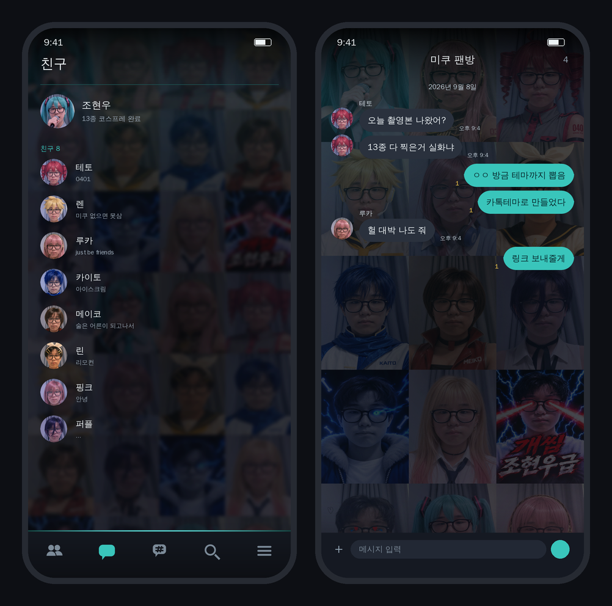

# VOCALOID COSPLAY — 카카오톡 테마

보컬로이드 코스프레 사진 13장으로 만든 카카오톡 테마 + 키보드 배경.



---

## 아이폰 — 카카오톡 테마

### 다운로드

**[VocaloidCosplay.ktheme 받기](https://github.com/DevToolXD/comi2/raw/refs/heads/claude/kakaotalk-theme-creation-bho737/ios/VocaloidCosplay.ktheme)** (5.9MB)

### 적용 방법

1. 위 파일을 아이폰에서 다운로드
2. 카카오톡 **나와의 채팅방**에 파일 전송
3. 채팅방에 올라온 파일을 눌러 다운로드
4. 파일 미리보기 화면 우측 상단 **공유 버튼** → **카카오톡에 복사**
   - 또는 파일을 눌러 **테마 적용하기**
5. 카카오톡 → 설정 → 테마 에서 `VOCALOID COSPLAY` 선택

### 들어있는 것

| 항목 | 내용 |
| --- | --- |
| 친구목록 / 채팅목록 배경 | 사진 13장 모자이크 (흐림 처리, 글자 잘 보이게 어둡게) |
| 채팅방 배경 | 사진 13장 모자이크 |
| 말풍선 | 내 말풍선 미쿠 민트 `#39C5BB` / 상대 말풍선 다크 그레이 |
| 탭 아이콘 | 친구·채팅·오픈채팅·검색·게임·더보기 (기본/선택 상태) |
| 기본 프로필 | 미쿠 사진 |
| 잠금화면 | 배경 + 숫자 입력 점 + 키패드 눌림 효과 |
| 알림바 / 공유바 | 핑크 이름 `#FF6FA5` + 밝은 본문 |

---

## 키보드 배경 — 아이폰 · 갤럭시 공통

자판 키 하나하나에 얼굴이 박혀 있는 키보드 배경입니다. 총 35개 키 자리에 사진 13장이 순서대로 반복해서 들어갑니다. QWERTY와 한글 두벌식이 같은 배열이라 두 자판 모두 맞습니다.

### 다운로드

| 파일 | 크기 | 설명 |
| --- | --- | --- |
| **[keyboard_vocaloid.png](https://github.com/DevToolXD/comi2/raw/refs/heads/claude/kakaotalk-theme-creation-bho737/keyboard/keyboard_vocaloid.png)** | 1440×1040 | 기본 (추천) |
| **[keyboard_vocaloid_tall.png](https://github.com/DevToolXD/comi2/raw/refs/heads/claude/kakaotalk-theme-creation-bho737/keyboard/keyboard_vocaloid_tall.png)** | 1440×1300 | 숫자줄 있는 키보드용 |
| **[keyboard_vocaloid_dark.png](https://github.com/DevToolXD/comi2/raw/refs/heads/claude/kakaotalk-theme-creation-bho737/keyboard/keyboard_vocaloid_dark.png)** | 1440×1040 | 더 어두운 버전 (글자 잘 보임) |

### 적용 방법 — Gboard (아이폰 · 갤럭시 둘 다)

1. Gboard 앱 설치 후 키보드로 설정
2. 키보드 열고 왼쪽 위 톱니바퀴 → **테마**
3. **내 테마** → `+` → 위 이미지 선택
4. 밝기 조절 후 **완료** → 키 테두리 **켜기** 추천

### 적용 방법 — 삼성 키보드 (갤럭시)

삼성 키보드는 배경 이미지를 직접 넣는 기능이 One UI 버전에 따라 없을 수 있습니다. 없으면 Gboard를 쓰세요.

---

## 갤럭시 — 카카오톡 테마 (.apk, 진짜 테마)

이전 버전은 카톡 배경화면만 바꾸는 임시방편이었는데, 이번엔 **진짜 설치되는 테마 apk**를 만들었습니다.

### 다운로드

**[VocaloidCosplay.apk 받기](https://github.com/DevToolXD/comi2/raw/refs/heads/claude/kakaotalk-theme-creation-bho737/android/VocaloidCosplay.apk)** (3.9MB)

### 적용 방법

1. 위 apk를 갤럭시에서 다운로드
2. 파일 앱에서 눌러 설치 (처음이면 "출처를 알 수 없는 앱 허용" 필요 — 정상적인 사이드로드 경고입니다)
3. 설치된 앱을 한 번 실행 → **Apply Now** 버튼 누름
4. 카카오톡 → 설정 → 테마 에서 테마가 적용됩니다

### 어떻게 만들었는지 / 왜 이제야 되는지

지난 버전에서는 카카오 공식 테마 제작 가이드/샘플 프로젝트 서버(kakao.com, kakaocdn.net)가 이 작업 환경에서 막혀 있어서 진짜 apk를 못 만들었습니다. 이번엔 **사용자가 직접 만들어서 준 실제 동작하는 테마 apk**를 뜯어서(리소스 이름, `AndroidManifest.xml`, 서명 구조) 그 틀에 맞춰 새로 지었습니다:

- 배경·말풍선·탭 아이콘·프로필·잠금화면 이미지 51개를 사진 13장으로 교체
- 채팅 말풍선 2개(내 말풍선/상대 말풍선)는 안드로이드 9-patch(늘어나는 이미지) 포맷이라, 픽셀을 직접 다시 칠해서 늘어나는 정보(청크)는 원본 그대로 보존
- `resources.arsc` 안의 색상 값 45개를 민트/핑크 팔레트로 직접 패치
- 새 RSA 키로 APK Signature Scheme v2 서명까지 코드로 직접 구현해서 서명 (Android가 요구하는 서명 없이는 설치 자체가 안 됩니다)

이 세션엔 실제 안드로이드 기기/에뮬레이터가 없어서 **직접 설치 테스트는 못 해봤습니다.** 대신 서명이 맞는지 두 가지 방법으로 독립적으로 검증했습니다: ① 서명값을 처음부터 다시 계산해서 APK 안에 들어있는 값과 정확히 일치하는지 확인, ② `cryptography` 라이브러리로 RSA 서명 자체를 별도로 검증. 둘 다 통과했지만, 실기기 검증은 아니니 설치가 안 되면 **정확한 에러 문구를 알려주시면 바로 고칠게요.**

패키지명은 원본 apk 그대로 유지했습니다(`com.kakao.talk.theme.apchin`). 그 이름으로 이미 설치된 앱이 있다면 먼저 지우고 설치해야 합니다(서명이 다르면 같은 패키지명으로 덮어쓰기가 안 됨).

### 보너스: 배경화면만 바꾸기 (apk 없이)

apk 설치가 안 되는 상황이면 카톡 기본 배경 설정으로도 비슷한 느낌을 낼 수 있어요.

| 파일 | 크기 | 용도 |
| --- | --- | --- |
| **[chatroom_background.png](https://github.com/DevToolXD/comi2/raw/refs/heads/claude/kakaotalk-theme-creation-bho737/android/images/chatroom_background.png)** | 1440×3120 | 카카오톡 채팅방 배경 |
| **[wallpaper.png](https://github.com/DevToolXD/comi2/raw/refs/heads/claude/kakaotalk-theme-creation-bho737/android/images/wallpaper.png)** | 1440×3120 | 폰 배경화면 |

- **모든 채팅방**: 카카오톡 → 설정 → 채팅 → 배경화면 → 앨범에서 선택
- **특정 채팅방만**: 채팅방 → 메뉴(≡) → 채팅방 설정 → 배경화면

---

## 직접 다시 만들기

```bash
python3 -m pip install pillow
python3 tools/build_assets.py      # iOS 테마 이미지 생성
python3 tools/package_ktheme.py    # .ktheme 패키징
python3 tools/build_keyboard.py    # 키보드 배경 생성
python3 tools/build_preview.py     # 미리보기 목업

# 안드로이드 apk는 androguard가 필요합니다 (resources.arsc / 서명 다루는 용도)
python3 -m pip install androguard cryptography pillow
python3 tools/build_android_theme_apk.py <원본 테마 apk> android/VocaloidCosplay.apk
```

색을 바꾸려면 iOS는 `ios/src/KakaoTalkTheme.css`, 안드로이드는 `tools/build_android_theme_apk.py`의 `COLOR_MAP`을 고치면 됩니다. 사진 순서는 각 스크립트의 `ORDER`.

`tools/build_android_theme_apk.py`는 카카오톡이 인식하는 리소스 이름·서명 구조가 이미 잡혀 있는 **본인이 만든 실제 동작하는 테마 apk**를 템플릿으로 받아야 동작합니다(카카오 공식 가이드로 만든 샘플 apk 등). 그 템플릿의 이미지/색상만 갈아끼우고 새로 서명해서 내보냅니다.

### 폴더 구조

```
photos/           원본 사진 13장
ios/src/Images/   iOS 테마 이미지 58개
ios/src/KakaoTalkTheme.css
ios/VocaloidCosplay.ktheme      ← 아이폰용 완성 파일
android/VocaloidCosplay.apk     ← 갤럭시용 완성 파일 (진짜 설치되는 테마 apk)
android/images/   보너스: apk 없이 쓰는 배경 이미지
keyboard/         키보드 배경
tools/            생성 스크립트
  vendor/         순수 파이썬 APK v2 서명 구현 (MIT+Commons Clause, 출처 표기됨)
docs/             다운로드 페이지
```

`.ktheme` 파일은 그냥 zip입니다. 확장자를 `.zip`으로 바꾸면 안을 열어볼 수 있어요.
